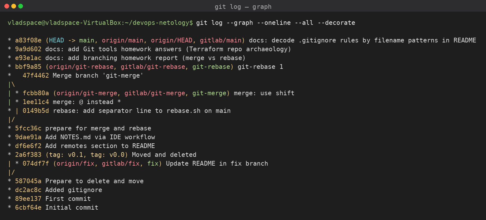

# Ветвления в Git: merge и rebase

Отчёт по домашнему заданию «Ветвления в Git». В каталоге `branching/` два скрипта
(`merge.sh`, `rebase.sh`), выводящие параметры запуска. На их примере показана разница
между слиянием (`merge`) и перебазированием (`rebase`), включая разрешение конфликтов.

## Ссылки

- **Network-граф (GitHub):** https://github.com/vpakspace/devops-netology/network
- **GitHub:** https://github.com/vpakspace/devops-netology
- **GitLab:** https://gitlab.com/vpakspace/devops-netology

## Граф коммитов из терминала

Снимок вывода `git log --graph --oneline --all --decorate` (на случай сбоев GitHub Network):



Видно структуру ветвления: merge-коммит `47f4462 Merge branch 'git-merge'` с развилкой
(слияние ветки `git-merge`) и поверх него — коммит `bbf9a85 git-rebase 1`, влитый в `main`
перемоткой (fast-forward) после rebase.

## Что было сделано

### Подготовка (ветка `main`)
- Созданы `branching/merge.sh` и `branching/rebase.sh` (вариант с `$*`).
- Коммит `prepare for merge and rebase`.

### Ветка `git-merge`
- `merge: @ instead *` — цикл `for` по `"$@"` вместо `"$*"`.
- `merge: use shift` — перебор аргументов через `while [[ -n "$1" ]]` + `shift`.

### Изменение `main`
- В `rebase.sh` добавлены `"$@"` и строка-разделитель `echo "====="`
  (коммит `rebase: add separator line to rebase.sh on main`) — имитация работы
  другого разработчика, пока шла работа в `git-merge`.

### Ветка `git-rebase` (от коммита `prepare for merge and rebase`)
- `git-rebase 1` — `echo "Parameter: $param"`.
- `git-rebase 2` — `echo "Next parameter: $param"`.

## Merge

```
git checkout main
git merge git-merge
```

`git-merge` менял только `merge.sh`, а `main` — только `rebase.sh`, поэтому слияние
прошло **без конфликтов** и создало merge-коммит `Merge branch 'git-merge'` (стратегия `ort`).

## Rebase (с конфликтами)

```
git checkout git-rebase
git rebase -i main      # нижний коммит помечен как fixup -> объединение в один
```

Так как и `main`, и `git-rebase` правили один и тот же участок `rebase.sh`, возникли
**два конфликта**, которые разрешались вручную:

1. Первый конфликт — оставлен вариант `echo "\$@ Parameter #$count = $param"` (версия `main`).
2. Второй конфликт (коммит `git-rebase 2`/fixup) — оставлена строка `echo "Next parameter: $param"`.

После `git add rebase.sh` + `git rebase --continue` два коммита объединены в один.
Поскольку ветка уже была отправлена в удалённый репозиторий, потребовался
**force-push** (история переписана):

```
git push -u origin git-rebase -f
```

Затем `git-rebase` влит в `main` обычной **перемоткой** (fast-forward), без merge-коммита:

```
git checkout main
git merge git-rebase   # Fast-forward
```

## Разница merge и rebase

| | merge | rebase |
|---|---|---|
| История | Сохраняет ветвление, добавляет merge-коммит | Линейная, коммиты «переносятся» поверх базы |
| Хеши коммитов | Не меняются | Переписываются (новые хеши) |
| Конфликты | Решаются один раз в merge-коммите | Могут возникать на каждом переносимом коммите |
| Push после | Обычный | Часто требует `--force` (переписана история) |
| Когда удобно | Сохранить полный контекст слияния | Подчистить промежуточные коммиты в один, линейная история |

## Итоговое содержимое

`merge.sh` — перебор аргументов через `shift`; `rebase.sh` — цикл по `"$@"`
со строкой `echo "Next parameter: $param"` и разделителем `=====`.
