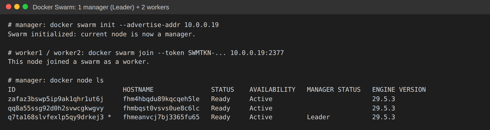

# Домашнее задание «Оркестрация кластером Docker Swarm»

> Примечание: это задание для самостоятельной отработки навыков, не предполагает обратной
> связи преподавателя и не влияет на завершение модуля. Выполнено для закрепления.

Выполнена **Задача 1** — создание Docker Swarm-кластера в Yandex Cloud.

## Задача 1. Swarm-кластер (1 manager + 2 worker)

### Инфраструктура
3 облачные ВМ в одной сети (Yandex Cloud, zone `ru-central1-a`, по 2 ГБ RAM, Ubuntu 22.04):

| ВМ | Роль | Внутренний IP |
|----|------|---------------|
| swarm-manager | manager (Leader) | 10.0.0.19 |
| swarm-worker1 | worker | 10.0.0.18 |
| swarm-worker2 | worker | 10.0.0.31 |

Security group открывает порт 22 (SSH) снаружи и весь трафик между нодами внутри подсети
`10.0.0.0/24` (swarm использует 2377/tcp — управление, 7946/tcp+udp — обмен между нодами,
4789/udp — overlay-сеть).

### Шаги

1. На каждой ВМ установлен Docker:
   ```bash
   curl -fsSL https://get.docker.com | sudo sh
   ```

2. Инициализация кластера на manager:
   ```bash
   sudo docker swarm init --advertise-addr 10.0.0.19
   ```

3. Подключение рабочих нод (worker1, worker2):
   ```bash
   sudo docker swarm join --token SWMTKN-1-... 10.0.0.19:2377
   # This node joined a swarm as a worker.
   ```

4. Проверка списка нод на manager:
   ```bash
   sudo docker node ls
   ```

### Результат

Кластер из 3 нод: 1 manager (со статусом **Leader**) и 2 worker, все `Ready` / `Active`,
Docker Engine 29.5.3.



> Облачные ресурсы (3 ВМ, сеть, подсеть, security group) удалены после демонстрации
> согласно инструкции по экономии облачных средств.

### Краткая теория

- **Swarm-кластер** — группа Docker-хостов в режиме swarm: **manager**-ноды поддерживают
  состояние кластера и планируют задачи, **worker**-ноды выполняют контейнеры (tasks).
- **Leader** — среди manager-нод выбирается лидер по алгоритму консенсуса **Raft**; он
  принимает решения об оркестрации, остальные manager'ы — реплики на случай отказа.
- **Порт 2377** — управление кластером, **7946** — обнаружение нод, **4789** — overlay-сети
  (VXLAN) для связи контейнеров между хостами.
